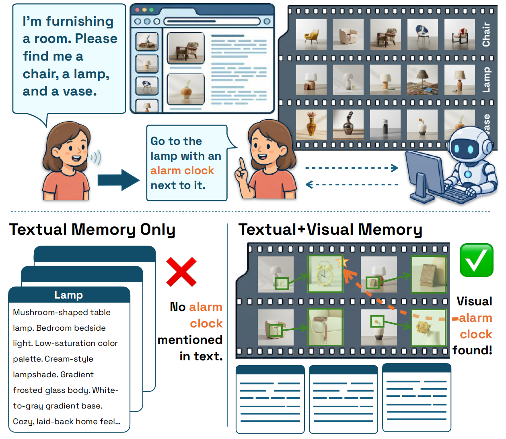
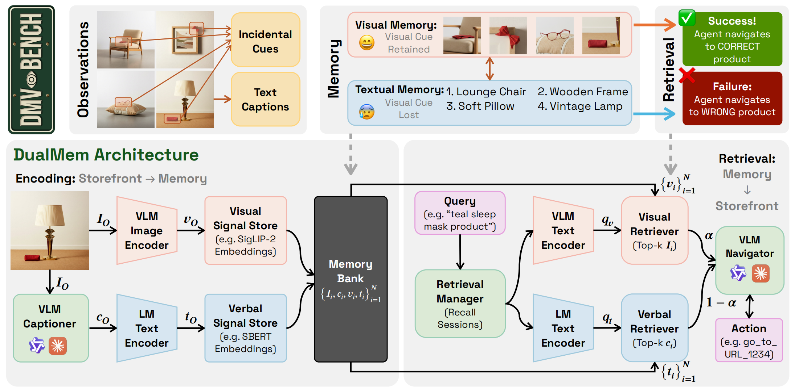

# DMV-Bench: Diagnosing Long-Horizon Multimodal Agents' Visual Memory with Incidental Cue Injection

Code release accompanying the paper *DMV-Bench: Diagnosing Long-Horizon
Multimodal Agents' Visual Memory with Incidental Cue Injection*. This
repository contains:

- **DMV-Bench** is an interactive, multi-session benchmark for *visual* agent
  memory. The agent runs a chain of $J \in \{5,10,15,50\}$ autonomous
  shopping sessions over a controlled $1{,}000$-variant home-furnishing
  storefront. Every visited product image carries a unique, pre-rendered
  *incidental cue*; a strict L2-leakage contract keeps the cue out of every
  text channel, so only a memory architecture that retains pixels can answer
  the recall probes. Evaluation sweeps *recall reach* $r$ (the session-distance
  between visit and probe) to read off how long an incidentally-seen cue
  survives.

- **DualMem** is a dual-coding-inspired memory architecture that holds a
  visual and a verbal code for every observation, stores both in one bank,
  and fuses the visual (SigLIP-2) and verbal (SBERT) scores at retrieval
  before injecting the top image *and* caption into the next-action VLM.
  DualMem leads every baseline at every chain length on both back-ends
  (Gemini 2.5 Flash and Qwen2.5-VL-7B), with the lead surviving controls
  for memory-bank size and encoding-position bias.

<p align="center">
  
</p>

<p align="center"><em>An incidental cue (an alarm clock) appears only in the
product image and is never mentioned in text, so text-only memory fails the
recall probe while a memory that retains pixels succeeds.</em></p>

## Getting started

1. **Python deps**

   ```bash
   pip install -r requirements.txt
   # one-time: fetch the headless browser the agent drives the storefront with
   playwright install chromium
   ```

   For a GPU box, install the CUDA build of PyTorch first (see the note in
   `requirements.txt`); the encoders fall back to CPU otherwise.

2. **Catalogue images.** Every storefront product carries a unique baked-in
   incidental cue, so the runner and the storefront share one `with_cue` image
   set (~1.5 GB). We release the original catalogue as a public Hugging Face
   dataset, [`yyyujintang/DMV-Bench-Images`](https://huggingface.co/datasets/yyyujintang/DMV-Bench-Images).
   Fetch it into the layout the code expects (no token needed):

   ```bash
   python scripts/download_images.py            # add --link-frontend to save ~1.5 GB
   ```

   This populates `data/vismem_diag_v2/images/with_cue/` (read by the runner)
   and `env/frontend/public/images_v2/` (served by the storefront). Point at a
   different mirror with `--repo-id` or `DMVBENCH_IMAGES_REPO`. To instead
   regenerate the catalogue from scratch, see `pipeline/` (requires a Gemini
   Imagen / NanoBanana key).

3. **Frontend**

   ```bash
   cd env/frontend
   npm install                       # also runs `prisma generate`
   cp .env.example .env              # sets DATABASE_URL=file:../prisma/dev.db
   npx prisma db push                # create the SQLite schema
   npm run seed:v2                   # load the 1,000-variant catalogue
   ```

   > Use `prisma db push` (not `migrate dev`): the committed migrations target
   > Postgres for the hosted-deploy path, while local dev runs on SQLite.

4. **Run the dev server**: `npm run dev -- -p 3000`

5. **Run an experiment** (from the repo root, with a `GEMINI_API_KEY` exported):

   ```bash
   # Incidental-Cue task, J=5 chain, Gemini back-end, single seed:
   python scripts/run_dmvbench_f2.py \
       --n-sessions 5 \
       --vlm gemini-2.5-flash --base-url http://localhost:3000 \
       --systems DualMem-a75 --seeds 0 \
       --out-dir results/J5_DualMem-a75/
   ```

   Writes `f2_summary.csv`, `f2_per_probe.csv`, and per-probe logs under
   `--out-dir`. Session length is fixed by the chain generator (22-28 steps,
   drawn from the seed), so a chain is fully determined by `--seeds` and
   `--n-sessions`.

6. **Qwen2.5-VL-7B back-end.** Serve the model with **vLLM 0.21.0**:

   ```bash
   python -m vllm.entrypoints.openai.api_server \
       --model Qwen/Qwen2.5-VL-7B-Instruct \
       --port 8000 --host 0.0.0.0 \
       --max-model-len 16384 --gpu-memory-utilization 0.85 \
       --max-num-seqs 64 --dtype bfloat16 \
       --limit-mm-per-prompt '{"image":8}' --trust-remote-code
   ```

   then pass `--vlm qwen-vl-7b-vllm --base-url http://<host>:8000/v1`.

   > `--limit-mm-per-prompt image=8` is required, not optional. A DualMem
   > recall step sends the current-page image plus up to `k=5` retrieved
   > memory images, so one request can carry six. Under the default limit of
   > 1 those requests fail, the harness scores the probe as a miss, and every
   > image-injecting system is silently deflated.

## Memory architectures audited

<p align="center">
  
</p>

<p align="center"><em>DualMem stores a visual code (SigLIP-2) and a verbal code
(SBERT) for every observation in one bank; retrieval fuses both scores and
injects the top image and caption into the next-action VLM.</em></p>

The seven systems share an `encode` / `retrieve` / `inject` interface
(`dualmem/systems/`). DualMem and the three external multimodal baselines run
under the same harness, driven through the same prompt surface
(`dualmem/agent/prompting.py`), so any per-cell gap reflects the memory
architecture rather than harness drift.

| System              | Encode               | Retrieve                | Inject       |
|---------------------|----------------------|-------------------------|--------------|
| NoMemory            | (none)               | (none)                  | (none)       |
| TextOnly            | encode_text          | SBERT cosine            | text         |
| Caption             | VLM caption          | SBERT cosine            | text         |
| WorldMM-lite        | ep+sem+vis modules   | adaptive iterative      | retrieved    |
| MMA-lite            | semantic store       | reliability-weighted    | text         |
| M2A-lite            | raw + semantic       | dense+BM25+visual fuse  | text         |
| **DualMem (ours)**  | image + caption      | hybrid (SigLIP + SBERT) | image+caption|

DualMem variants (`DualMem-a25`, `DualMem-a75`, `DualMem-vis`, `DualMem-verb`,
`DualMem-img`, `DualMem-cap`, `DualMem-vis-img`, `DualMem-vis-cap`) ablate
the hybrid retrieval-weight α and the injection modality. The headline number
in the paper uses `DualMem-a75` (visual-dominant fusion); `DualMem` (without
an α suffix) defaults to the symmetric α=0.5 baseline.

## Task family

DMV-Bench is built around a *single* task type, **Incidental Cue (IC)**,
instantiated as a chain of $J$ short shopping sessions.

Each session is one comparison-shopping task over **one product category**: a
memoryless ReAct agent is asked to open at least three *style collections*
within that category and as many distinct products as it can, over 22-28 steps.
(Gemini 2.5 Flash averages 11.0 distinct products per session; Qwen2.5-VL-7B
averages 4.2.) Cues sit in the product images and are never mentioned in text.

Recall probes run after every session, from the bank state at that point. Each
probe names one cue in words -- *"Earlier you saw a product that had a red wool
scarf on it. Take me back to that exact product."* -- and the agent has 8 steps
to `navigate` to it. Probes are read-only: they retrieve and navigate but never
write to the bank, so they cannot perturb the chain. Scoring is exact URL match
against a bijective ground truth: the 1,000 (object, colour) cue pairs map
one-to-one onto the 1,000 products, so every probe has exactly one right answer.
The diagnostic axis is **recall reach** $r$, the number of session boundaries
between the visit and the probe.

Long chains are cheap because **encoding sessions are cached and shared**.
The encoding agent is memoryless, so session $j$ of a chain depends only on
$(\text{seed}, j)$ and never on $J$: a $J{=}15$ chain reuses every session of
the $J{=}5$ chain with the same seed, byte-for-byte. The same recorded
trajectories are then replayed into *every* memory architecture, so within a
cell each architecture is scored on an identical observation stream and an
identical probe set. There is no branching and no memory-snapshot restore --
a task is a linear chain.

## Data products

This repo ships **code plus the small JSON sources** (catalogue seed,
pricing/naming, cue registry under `env/scripts/` and `data/vismem_diag_v2/`).
Two large artefact families live outside git:

- **Catalogue images** (~3 GB: `with_cue/` set used by the benchmark plus the
  un-edited `base/` originals): released as the public Hugging Face dataset
  [`yyyujintang/DMV-Bench-Images`](https://huggingface.co/datasets/yyyujintang/DMV-Bench-Images);
  fetch with `scripts/download_images.py` (add `--with-base` for the
  originals), or rebuild with `pipeline/generate.py`.
- **Chain specs** (`tasks/pool_v2/f2_trees/*.json`): regenerated by
  `tasks/generators/f2_online_ic.py`, which the runner calls automatically
  for every `--seeds` value. They are a deterministic function of the seed,
  so there is nothing to download.
- **Encoding trajectories** (`data/vismem_diag_v2/f2_trajectories*/`): built
  on first run and cached per `(seed, session)`. They are back-end specific
  (Gemini and Qwen browse differently), so keep one cache dir per back-end
  via `--traj-dir`.

`data/vismem_diag_v2/_caption_cache.json` ships the Gemini caption for all
1,000 catalogue images -- the exact captions behind the paper's `Caption` and
`DualMem` runs. The verbal channel is Gemini-captioned for **both** back-ends,
so without this cache even a Qwen-only run would need a `GEMINI_API_KEY`; with
it, the paper's configuration reproduces without one.

Per-probe logs are written under `results/` at run time and are not included.

## License

Apache-2.0 (see `LICENSE`).
